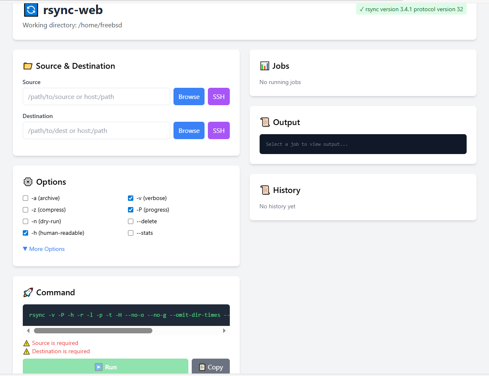

# rsync-web

A modern, lightweight web UI for rsync with real-time output streaming via WebSockets.



## Features

- **Real-time output streaming** - Watch rsync progress live via WebSocket (no page refresh needed)
- **Multiple concurrent jobs** - Run and monitor several rsync operations simultaneously
- **Command history** - View past commands, reuse them, or modify and re-run
- **File browser** - Navigate directories and select source/destination paths visually
- **SSH host integration** - Automatically reads hosts from `~/.ssh/config`
- **Comprehensive rsync options** - All common flags available via checkboxes:
  - Archive (`-a`), Verbose (`-v`), Compress (`-z`), Progress (`-P`)
  - Dry-run (`-n`), Delete (`--delete`), Human-readable (`-h`)
  - Recursive, symlinks, permissions, times, group, owner, devices
  - Partial, append, ignore-existing, size-only, checksum, backup
- **Exclude patterns** - Multi-line exclude support
- **Custom options** - Add any rsync flag (e.g., `--bwlimit=1000`)
- **rsync availability check** - Warns if rsync isn't installed on the system
- **Cross-platform** - Works on Linux and FreeBSD

## Installation

### Pre-built binaries

Download from [Releases](https://github.com/jgbrwn/rsync-web/releases) (coming soon) or build from source.

### Build from source

```bash
# Clone
git clone https://github.com/jgbrwn/rsync-web.git
cd rsync-web

# Build for current platform
make build

# Or build for specific platforms
make build-linux    # Linux amd64
make build-freebsd  # FreeBSD amd64
make build-all      # Both platforms
```

Requires Go 1.21+ and rsync installed on the target system.

## Usage

```bash
# Run from current directory (files browsable from pwd)
./rsync-web

# Custom listen address and port
./rsync-web -listen 0.0.0.0:8080

# Custom working directory for file browsing
./rsync-web -dir /data/backups

# Combine options
./rsync-web -listen 192.168.1.100:9000 -dir /mnt/storage
```

Then open http://127.0.0.1:8000 in your browser.

## Command-line Options

| Flag | Default | Description |
|------|---------|-------------|
| `-listen` | `127.0.0.1:8000` | Address and port to listen on |
| `-dir` | Current directory | Working directory for file browsing |

## How It Works

1. **Select source and destination** - Type paths manually, use the file browser, or pick SSH hosts
2. **Configure options** - Check the rsync flags you need, add excludes or custom options
3. **Preview command** - See the exact rsync command that will run
4. **Run** - Execute and watch real-time output in the browser
5. **Monitor** - Switch between multiple running jobs, cancel if needed
6. **Reuse** - Click any history entry to reload its settings

## Architecture

- **Backend**: Go with gorilla/websocket for real-time streaming
- **Database**: SQLite (pure Go, no CGO) for command history
- **Frontend**: Vanilla JS with Tailwind CSS
- **No external dependencies** at runtime beyond rsync itself

## FreeBSD Support

Fully tested on FreeBSD. Install rsync if needed:

```bash
pkg install rsync
```

All features work identically on FreeBSD and Linux.

## Security Notes

- By default, listens only on `127.0.0.1` (localhost)
- File browser is restricted to the working directory and subdirectories
- No authentication built-in - use a reverse proxy if exposing to a network

## License

MIT
